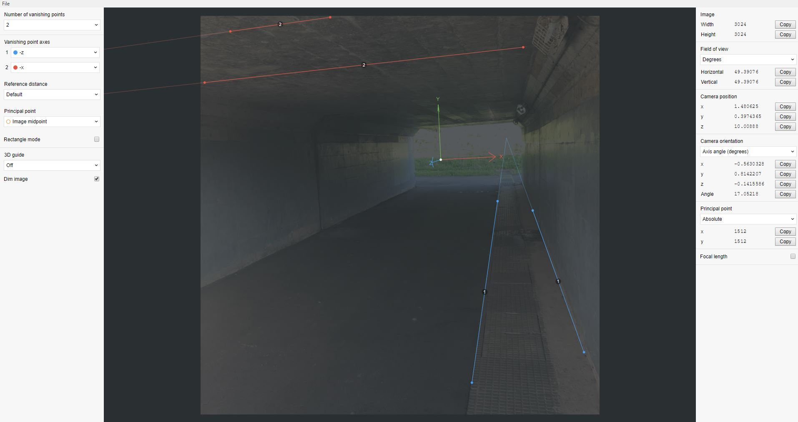

# three-fspy-camera-loader

[](https://www.npmjs.com/package/three-fspy-camera-loader)
[](https://github.com/nasikusa/three-fspy-camera-loader/blob/master/LICENSE)


[demo page](https://embed.nasikusa.net/fspy-three-demo/)

## What is this?

Script for importing [fSpy](https://fspy.io/) camera data into [three.js](https://threejs.org/).

You can create a pseudo AR-like visual representation.

I made [a demo on this page](https://embed.nasikusa.net/fspy-three-demo/).

It takes in the json format camera data output by fSpy and converts it into the [PerspetiveCamera](https://threejs.org/docs/#api/en/cameras/PerspectiveCamera) of three.js.

three-fspy-camera-loader inherits the [Loader](https://threejs.org/docs/#api/en/loaders/Loader) object of three.js and can be used in the same way as other loaders.

I'm Japanese so I'm not good at English. So I'm sorry if I used the wrong English.

## Installing from npm

`$ npm install --save three-fspy-camera-loader`

## Examples

[codesandbox(TypeScript)](https://codesandbox.io/s/typescript-demo-basic-orylt?file=/src/FSpyCameraLoaderExample.ts)

If it doesn't work, reload.

Other examples are in preparation.

## Link Collection

[fSpy official website](https://fspy.io/)

[fspy repository](https://github.com/stuffmatic/fSpy)

[fSpy video](https://vimeo.com/300690108)

[fSpy importer addon for Blender](https://github.com/stuffmatic/fSpy-Blender)

## Getting Started

```javascript
var loader = new FSpyCameraLoader();
var camera;

loader.load(
  'path/to/fSpyJsonFile',
  // onload
  function ( result ) {
    camera = result;
  },
  // onprogress
  function ( xhr ) {
    console.log( ( xhr.loaded / xhr.total * 100 ) + '% loaded' );
  },
  // onerror
  function ( error ) {
    console.log( 'ERROR' );
  }
);
```

If you want to include a background image, you can use the following example. Of course, other methods are also acceptable.

```css
html,body {
  margin: 0;
  padding: 0;
  height: 100%;
  overflow: hidden;
}
#myCanvas {
  width: 100%;
  height: 100%;
  background-image: url(path/to/image);
  background-size: cover;
  background-position: 50% 50%;
  background-repeat: no-repeat;
}
```

```javascript

var camera;

var renderer = new THREE.WebGLRenderer({
  canvas: document.querySelector('#myCanvas'),
  alpha: true,
});
renderer.setPixelRatio(window.devicePixelRatio);
renderer.setClearColor(0x000000, 0);
renderer.setSize(window.innerWidth, window.innerHeight);

var scene = new THREE.Scene();
var geometry = new THREE.BoxGeometry(3, 3, 3);
var material = new THREE.MeshNormalMaterial();
var box = new THREE.Mesh(geometry, material);
box.position.set(0, 0, 0);
scene.add(box);

var fSpyCameraLoader = new FSpyCameraLoader();
fSpyCameraLoader.setCanvas(document.querySelector('#myCanvas'));
// If you want to make the behavior behave like CSS background-size: cover, use this function.
fSpyCameraLoader.setResizeUpdate();

fSpyCameraLoader.load('path/to/fSpyJson', function ( result ) {
  camera = result;
  renderLoop();
});

window.addEventListener('resize', function () {
  renderer.setSize(window.innerWidth, window.innerHeight);
});

function renderLoop() {
  requestAnimationFrame(renderLoop);
  renderer.render(scene, camera);
  box.rotation.y += 0.01;
}

```

## Notice

### json export

You can export json using fSpy from here.


### Axis setting

When using with three.js, it is recommended that the Y-axis be up.



##  constructor

\+ **new FSpyCamerLoader**(`manager?`: LoadingManager): *[FSpyCamerLoader](https://github.com/nasikusa/three-fspy-camera-loader/blob/master/docs/classes/_fspycameraloader_.fspycamerloader.md)*

*Overrides void*

*Defined in [src/FSpyCameraLoader.ts:37](https://github.com/nasikusa/THREE.FSpyCamera/blob/9e3dc6a/src/FSpyCameraLoader.ts#L37)*

**Parameters:**

| Name       | Type           |
| ---------- | -------------- |
| `manager?` | LoadingManager |

**Returns:** *[FSpyCamerLoader](https://github.com/nasikusa/three-fspy-camera-loader/blob/master/docs/classes/_fspycameraloader_.fspycamerloader.md)*


## Main Properties

| Name                                                         | Type                                                         | Description                                                  |
| ------------------------------------------------------------ | ------------------------------------------------------------ | :----------------------------------------------------------- |
| [.camera](https://github.com/nasikusa/three-fspy-camera-loader/blob/master/docs/classes/_fspycameraloader_.fspycamerloader.md#camera) | [PerspectiveCamera](https://threejs.org/docs/#api/en/cameras/PerspectiveCamera) | PerspectiveCamera of three.js. The final result is stored on this camera. |
| [.dataManager](https://github.com/nasikusa/three-fspy-camera-loader/blob/master/docs/classes/_fspycameraloader_.fspycamerloader.md#datamanager) | [FSpyDataManager](https://github.com/nasikusa/three-fspy-camera-loader/blob/master/docs/classes/_fspydatamanager_.fspydatamanager.md) | Class that manages camera data of fSpy. Mainly used internally.<br>[more information](https://github.com/nasikusa/three-fspy-camera-loader/blob/master/docs/classes/_fspydatamanager_.fspydatamanager.md) |
| [.targetCanvas](https://github.com/nasikusa/three-fspy-camera-loader/blob/master/docs/classes/_fspycameraloader_.fspycamerloader.md#targetcanvas) | HTMLCanvasElement \| null                                    | Canvas that is the target for drawing WebGL. It is mainly used for updating the camera according to the resize. |
| [.isEnableResizeEvent](https://github.com/nasikusa/three-fspy-camera-loader/blob/master/docs/classes/_fspycameraloader_.fspycamerloader.md#isenableresizeevent) | boolean                                                      | (get) Gets whether the resize event is set.<br>(set) Enable / disable resize event |

[all properties](https://github.com/nasikusa/three-fspy-camera-loader/blob/master/docs/classes/_fspycameraloader_.fspycamerloader.md#properties-1)

## Main Methods

###  load

▸ **load**(`url`: string, `onLoad?`: undefined | function, `onProgress?`: undefined | function, `onError?`: undefined | function): *void*

*Defined in [src/FSpyCameraLoader.ts:80](https://github.com/nasikusa/THREE.FSpyCamera/blob/9e3dc6a/src/FSpyCameraLoader.ts#L80)*

load fSpy's camera data json

**Parameters:**

| Name          | Type                      | Description                                                  |
| ------------- | ------------------------- | ------------------------------------------------------------ |
| `url`         | string                    | Path to camera data json to be exported by fSpy              |
| `onLoad?`     | undefined &#124; function | Function after loading                                       |
| `onProgress?` | undefined &#124; function | Function being loaded. Probably not needed due to the small data size. |
| `onError?`    | undefined &#124; function | Function when the error occurred TODO: IE                    |

**Returns:** *void*

___

###  loadAsync

▸ **loadAsync**(`url`: string, `onProgress?`: undefined | function): *Promise‹any›*

Defined in node_modules/three/src/loaders/Loader.d.ts:20

**Parameters:**

| Name          | Type                      | Description                                                  |
| ------------- | ------------------------- | ------------------------------------------------------------ |
| `url`         | string                    | Path to camera data json to be exported by fSpy              |
| `onProgress?` | undefined &#124; function | Function being loaded. Probably not needed due to the small data size. |

**Returns:** *Promise‹any›*

___

###  parse

▸ **parse**(`fSpyJson`: [FSpyCameraJson](https://github.com/nasikusa/three-fspy-camera-loader/blob/master/docs/interfaces/_type_.fspycamerajson.md)): *PerspectiveCamera*

*Defined in [src/FSpyCameraLoader.ts:115](https://github.com/nasikusa/THREE.FSpyCamera/blob/9e3dc6a/src/FSpyCameraLoader.ts#L115)*

Parses fSpy json data. This function is also called after the load function.

**Parameters:**

| Name       | Type                                                         | Description                                                  |
| ---------- | ------------------------------------------------------------ | ------------------------------------------------------------ |
| `fSpyJson` | [FSpyCameraJson](https://github.com/nasikusa/three-fspy-camera-loader/blob/master/docs/interfaces/_type_.fspycamerajson.md) | json data from fSpy. Please put the parsed one, such as JSON.parse (json) ;. |

**Returns:** *PerspectiveCamera*

Camera using fSpy camera data

---

###  getComputedData

▸ **getComputedData**(): *[FSpyCameraData](https://github.com/nasikusa/three-fspy-camera-loader/blob/master/docs/interfaces/_type_.fspycameradata.md) | null*

*Defined in [src/FSpyCameraLoader.ts:227](https://github.com/nasikusa/THREE.FSpyCamera/blob/9e3dc6a/src/FSpyCameraLoader.ts#L227)*

Get camera data processed for three.js

**Returns:** *[FSpyCameraData](https://github.com/nasikusa/three-fspy-camera-loader/blob/master/docs/interfaces/_type_.fspycameradata.md) | null*

json data from fSpy converted to data for three.js

___

###  getData

▸ **getData**(): *[FSpyCameraJson](https://github.com/nasikusa/three-fspy-camera-loader/blob/master/docs/interfaces/_type_.fspycamerajson.md) | null*

*Defined in [src/FSpyCameraLoader.ts:219](https://github.com/nasikusa/THREE.FSpyCamera/blob/9e3dc6a/src/FSpyCameraLoader.ts#L219)*

Get unprocessed internal camera data

**Returns:** *[FSpyCameraJson](https://github.com/nasikusa/three-fspy-camera-loader/blob/master/docs/interfaces/_type_.fspycamerajson.md) | null*

json data output from fSpy

___

###  onResize

▸ **onResize**(): *void*

*Defined in [src/FSpyCameraLoader.ts:195](https://github.com/nasikusa/THREE.FSpyCamera/blob/9e3dc6a/src/FSpyCameraLoader.ts#L195)*

Change the camera data according to the size of the canvas to render.

**Returns:** *void*

___

###  setCanvas

▸ **setCanvas**(`canvas`: HTMLCanvasElement): *void*

*Defined in [src/FSpyCameraLoader.ts:124](https://github.com/nasikusa/THREE.FSpyCamera/blob/9e3dc6a/src/FSpyCameraLoader.ts#L124)*

Add the data for the canvas element for the library to know.

**Parameters:**

| Name     | Type              | Description                                 |
| -------- | ----------------- | ------------------------------------------- |
| `canvas` | HTMLCanvasElement | Canvas that is the target for drawing WebGL |

**Returns:** *void*

___

###  removeCanvas

▸ **removeCanvas**(): *void*

*Defined in [src/FSpyCameraLoader.ts:131](https://github.com/nasikusa/THREE.FSpyCamera/blob/9e3dc6a/src/FSpyCameraLoader.ts#L131)*

Remove the data for the canvas element.

**Returns:** *void*

___

###  setResizeUpdate

▸ **setResizeUpdate**(): *void*

*Defined in [src/FSpyCameraLoader.ts:138](https://github.com/nasikusa/THREE.FSpyCamera/blob/9e3dc6a/src/FSpyCameraLoader.ts#L138)*

Enables the ability to change the camera data according to the size of the canvas to render.

**Returns:** *void*

___

###  removeResizeupdate

▸ **removeResizeupdate**(): *void*

*Defined in [src/FSpyCameraLoader.ts:145](https://github.com/nasikusa/THREE.FSpyCamera/blob/9e3dc6a/src/FSpyCameraLoader.ts#L145)*

Disables the ability to change camera data to fit the size of the canvas to render.

**Returns:** *void*

---

[all methods](https://github.com/nasikusa/three-fspy-camera-loader/blob/master/docs/classes/_fspycameraloader_.fspycamerloader.md#methods-1)

## API documentation

Please see [here](./docs/README.md).

## LISENCE

MIT
